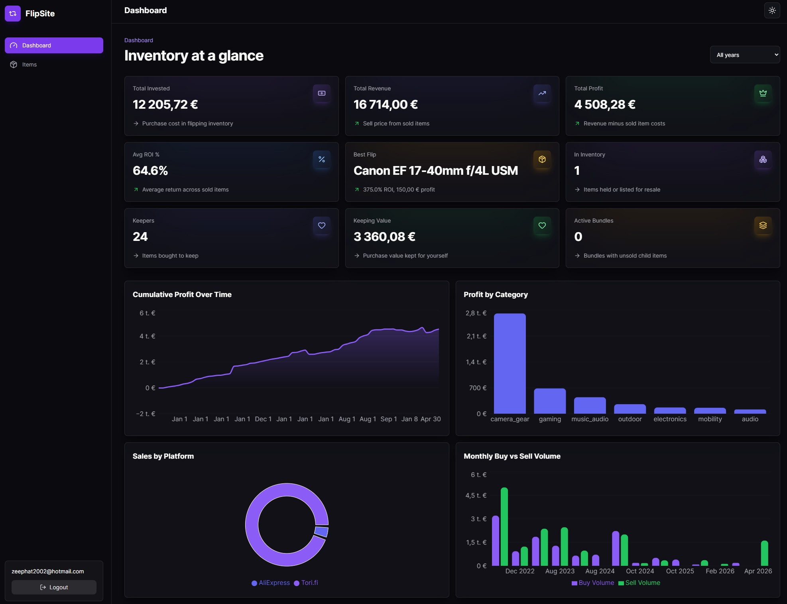

# FlipSite

Real-world flipping and inventory tracking, built for the messy middle between a spreadsheet and a full accounting system.

**Live app:** https://flipsite-three.vercel.app/



## Overview

FlipSite is a personal resale and inventory tracker built from an actual buying, bundling, listing, and selling workflow. It replaces the fragile spreadsheet version of that process with authenticated data, image-backed item records, bundle-aware calculations, fast filtering, and dashboard analytics.

What makes it interesting is the shape of the data: not every purchase is a clean one-item flip. Some purchases become bundles, some items are kept, some are listed later, and profit only makes sense if the app understands those relationships.

## Key Features

- **Bundle-aware inventory system**  
  Track parent purchases with child items split out underneath them.

- **Correct profit calculation**  
  Bundle parents include child sales so totals do not undercount or double count.

- **Image uploads with compression and paste support**  
  Upload files normally or paste screenshots/images directly into an item drawer.

- **Dual item views**  
  Switch between a compact table view and a gallery view with signed thumbnails.

- **Advanced filtering and sorting**  
  Filter by status, seller/platform, category, bundles, inventory state, and search.

- **Dashboard insights**  
  See profit, revenue, invested capital, keeping value, inventory count, ROI, and bundle state.

- **Private per-user data**  
  Supabase Auth, Postgres, Storage, and RLS keep each user's inventory isolated.

## Interesting Implementation Details

### Bundle Logic

Bundles are modeled as parent items with child rows. The parent keeps the original purchase cost, while children can be sold individually. Profit and ROI calculations account for that relationship, so selling child items contributes back to the bundle parent without duplicating purchase cost.

### Image Pipeline

Images are compressed before upload to keep storage and page weight under control:

- max long edge: `1600px`
- target size: about `200 KB`
- JPEG output for compressed images

Files are stored in a private Supabase Storage bucket and served through signed URLs. List and gallery thumbnails use transformed image URLs so the app does not load full-size images unnecessarily.

### Clipboard Paste Uploads

The item drawer supports a Telegram-style image workflow: paste a screenshot or copied image, convert clipboard blobs into real `File` objects, then send them through the same upload pipeline as selected files. That keeps compression, storage paths, metadata inserts, and error states consistent.

### Dashboard Accuracy

Dashboard metrics avoid common inventory mistakes:

- keeping items are tracked separately from active investment inventory
- bundle children do not double count purchase cost
- sold bundle children contribute to parent profit
- active inventory, invested value, ROI, and profit use purpose-specific calculations

## Tech Stack

- React, TypeScript, Vite
- Tailwind CSS
- Supabase Auth, Postgres, Storage, RLS
- TanStack Query
- Recharts
- Vercel

## Running Locally

```bash
npm install
cp .env.example .env
npm run dev
```

Add Supabase values to `.env`:

```bash
VITE_SUPABASE_URL=
VITE_SUPABASE_ANON_KEY=
```

Create a Supabase project, enable Email/Password auth, and run `supabase/schema.sql` in the Supabase SQL editor. The schema includes Row Level Security policies so users only access their own inventory.

## Deployment

FlipSite is deployed on Vercel. Set these environment variables in the Vercel project:

```bash
VITE_SUPABASE_URL
VITE_SUPABASE_ANON_KEY
```

`vercel.json` includes the SPA rewrite needed for React Router refreshes.
