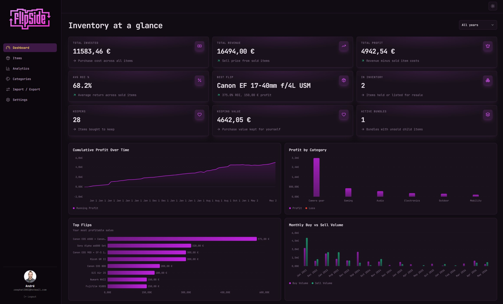

# FlipSite

I built this because I was tired of maintaining a spreadsheet to track what I own, what I've sold, and what I paid for things. FlipSite is a personal inventory and resale tracker — somewhere between a spreadsheet and a proper accounting tool, built for how I actually use it.

**Live:** https://flipsite-three.vercel.app/



---

## What it's for

Two main things:

**Inventory tracking.** I want to know what I own, when I bought it, where I bought it from, what I paid, and where I put the receipt or manual. Every item can have photos, files, and notes attached to it, so everything related to a purchase lives in one place instead of scattered across folders and email threads.

**Resale tracking.** When I sell something, I want to see the actual profit — not just sell price minus buy price, but across bundles too. If I buy a camera kit, sell three lenses separately, and keep the body, the numbers need to reflect that. That relationship between purchase and individual sales is the part spreadsheets handle badly.

---

## Features

### Items
- Add items with name, category, condition, buy price, sell price, buy platform, sell platform, status, dates, and notes
- Four statuses: **holding**, **listed**, **sold**, **keeping** (personal items tracked separately from flipping inventory)
- Attach photos, receipts, manuals, or any file to an item
- Paste images directly from clipboard — useful for pasting screenshots from a phone
- Images are compressed before upload and served as thumbnails so the app stays fast
- Full item detail page at `/items/:id` with image gallery, file list, notes, and financial summary

### Bundles
- Mark any purchase as a bundle and add child items under it
- Each child item can be sold, kept, or listed separately
- Profit calculations understand the structure — selling a child contributes to the bundle total without double-counting the purchase price

### Views and filtering
- List view: sortable table with all metrics visible
- Gallery view: visual grid using image thumbnails
- Filter by status, buy platform, sell platform, category, and free text search
- Additional filters for bundles-only and inventory-only views

### Dashboard
- KPI cards: total invested, total revenue, total profit, average ROI, best flip, inventory count, keepers count, keeping value, active bundles
- Charts: cumulative profit over time, profit by category, top 8 flips, monthly buy vs sell volume

### Analytics
- Date range filter plus multi-select filters for category, platform, and status
- Charts: monthly revenue, monthly profit, profit by category, profit by platform, ROI by category, hold time vs profit, profit pace over time

### Categories
- Rename or merge categories across all items at once

### Import / Export
- Export full inventory as CSV
- Import from CSV with a validation preview before anything is saved

### Settings
- 8 color themes, each with light and dark mode
- 6 font options
- Per-item defaults for platform, category, condition, and status
- Profile with avatar upload and username

---

## Tech stack

React, TypeScript, Vite, Tailwind CSS, Supabase (Postgres, Auth, Storage, RLS), TanStack Query, Recharts, Vercel.

---

## Running locally

```bash
npm install
cp .env.example .env
npm run dev
```

Add your Supabase credentials to `.env`:

```env
VITE_SUPABASE_URL=https://your-project.supabase.co
VITE_SUPABASE_ANON_KEY=your-anon-key
```

Create a Supabase project, enable Email/Password auth, and run `supabase/schema.sql` in the SQL editor.

## Deploying

Deploys to Vercel. Set `VITE_SUPABASE_URL` and `VITE_SUPABASE_ANON_KEY` as environment variables. `vercel.json` handles the SPA rewrite for React Router.