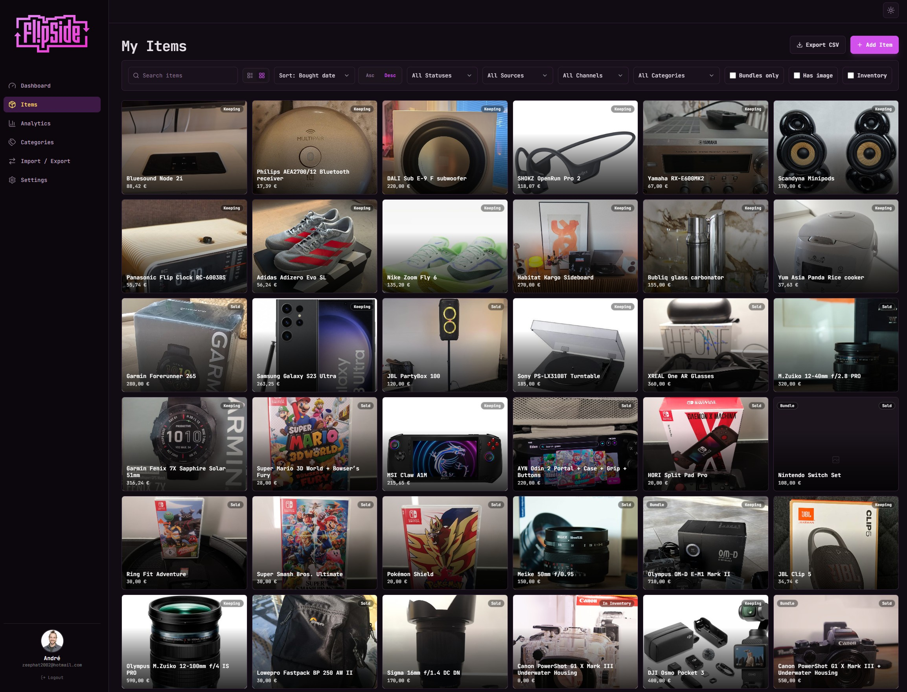
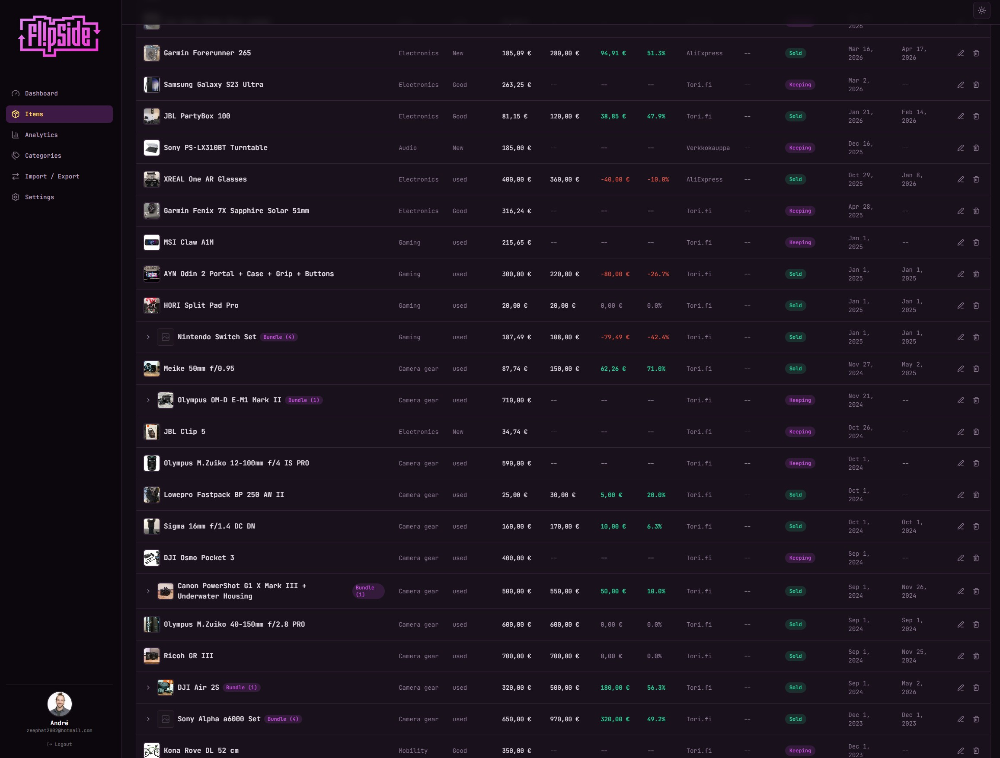
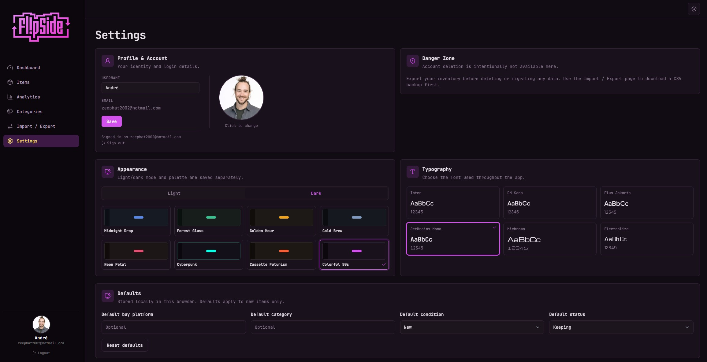

# FlipSite

I built this because I got tired of maintaining a spreadsheet. It started as a way to track what I buy and sell, but turned into something broader — a personal inventory tracker where I always know what I own, what I paid, where I bought it, and where the receipt is.

**Live:** https://flipsite-three.vercel.app/


---

## What it's for

Two things I actually use it for every day:

**Keeping track of my stuff.** I want to know what I own, when I bought it, what it cost, and where to find the receipt or manual. Every item can have photos and files attached to it, so everything related to a purchase lives in one place. No more digging through email for a warranty document or trying to remember if I paid 200 or 250 for something.

**Tracking what I sell.** When I flip something, I want to see the actual profit — not just sell minus buy, but across bundles too. If I buy a camera kit, sell the lenses separately, and keep the body, the numbers need to understand that. That's the part spreadsheets handle badly.

---

## Items

Everything lives in the items list. You can switch between a table view with all the metrics laid out, or a gallery view that shows your actual photos.



The table view is where things get useful for serious tracking — sortable columns, profit and ROI calculated per row, bundle relationships visible inline, and status badges that tell you at a glance what's sold, what's sitting, and what you're keeping.



Each item has:
- Name, category, condition, buy and sell price, buy and sell platform, status, dates bought and sold, notes
- Four statuses: **holding**, **listed**, **sold**, **keeping** — keeping items are tracked separately so they don't mess up your resale numbers
- Attached photos, receipts, manuals, or any other file
- Clipboard paste support — take a photo on your phone, paste the screenshot, it goes straight into the upload pipeline

Filters cover status, buy platform, sell platform, category, text search, bundles only, has-image, and inventory-only. The gallery view adds its own sort controls since you're often browsing visually there.

### Item detail page

Every item has its own page at `/items/:id` — useful when an item has a lot of photos, attached files, or is a bundle with several children. Left side shows the image gallery, attached files, and notes. Right side shows the financial summary, all the metadata, and how long you've held it.

### Bundles

When you buy a collection of things for one price, you can mark it as a bundle and add child items underneath it. Each child can be sold, listed, or kept separately. Profit math works correctly — selling a child contributes to the bundle's total without double-counting the original purchase.

---

## Dashboard

Nine KPI cards at the top, four charts below. The cards cover flipping capital, total revenue, total profit, average ROI, best flip, inventory count, keeper count, keeping value, and active bundles. Active bundles means bundle parents that still have unsold children — useful to know at a glance.

Charts: cumulative profit over time, profit by category, top 8 flips by profit, and monthly buy vs sell volume.

Everything excludes keeper items from profit and revenue calculations — they show up in their own cards but don't pollute the resale numbers.

---

## Analytics

A more detailed view with date range and multi-select filters that affect every number on the page. Useful for looking at a specific period or platform.

Charts: monthly revenue, monthly profit, profit by category, profit by platform, ROI by category, hold time vs profit, and cumulative profit vs a linear pace line.

---

## Settings

Profile with avatar upload and username. Then the part that took longer than expected to get right:



Eight color themes, each working in both light and dark mode — Midnight Drop, Forest Glass, Golden Hour, Cold Brew, Neon Petal, Cyberpunk, Cassette Futurism, Colorful 80s. Light and dark mode toggle independently from the theme. Six font options: Inter, DM Sans, Plus Jakarta Sans, JetBrains Mono, Michroma, Electrolize.

Defaults let you set a starting buy platform, category, condition, and status so new items don't start from scratch every time.

---

## Other bits

**Categories** — rename or merge categories across all items at once, useful after you realize you've been inconsistent with naming.

**Import / Export** — export your full inventory as CSV, import from CSV with a validation preview before anything gets saved.

---

## Tech stack

React, TypeScript, Vite, Tailwind CSS, Supabase (Postgres, Auth, Storage, RLS), TanStack Query, Recharts, Vercel.

---

## Running locally

```bash
npm install
cp .env.example .env
npm run dev
```

Add Supabase credentials to `.env`:

```env
VITE_SUPABASE_URL=https://your-project.supabase.co
VITE_SUPABASE_ANON_KEY=your-anon-key
```

Create a Supabase project, enable Email/Password auth, and run `supabase/schema.sql` in the SQL editor. The schema includes all tables, RLS policies, storage setup, and the bundle ownership trigger.

## Deploying

Vercel. Set `VITE_SUPABASE_URL` and `VITE_SUPABASE_ANON_KEY` as environment variables. `vercel.json` handles the SPA rewrite for React Router.